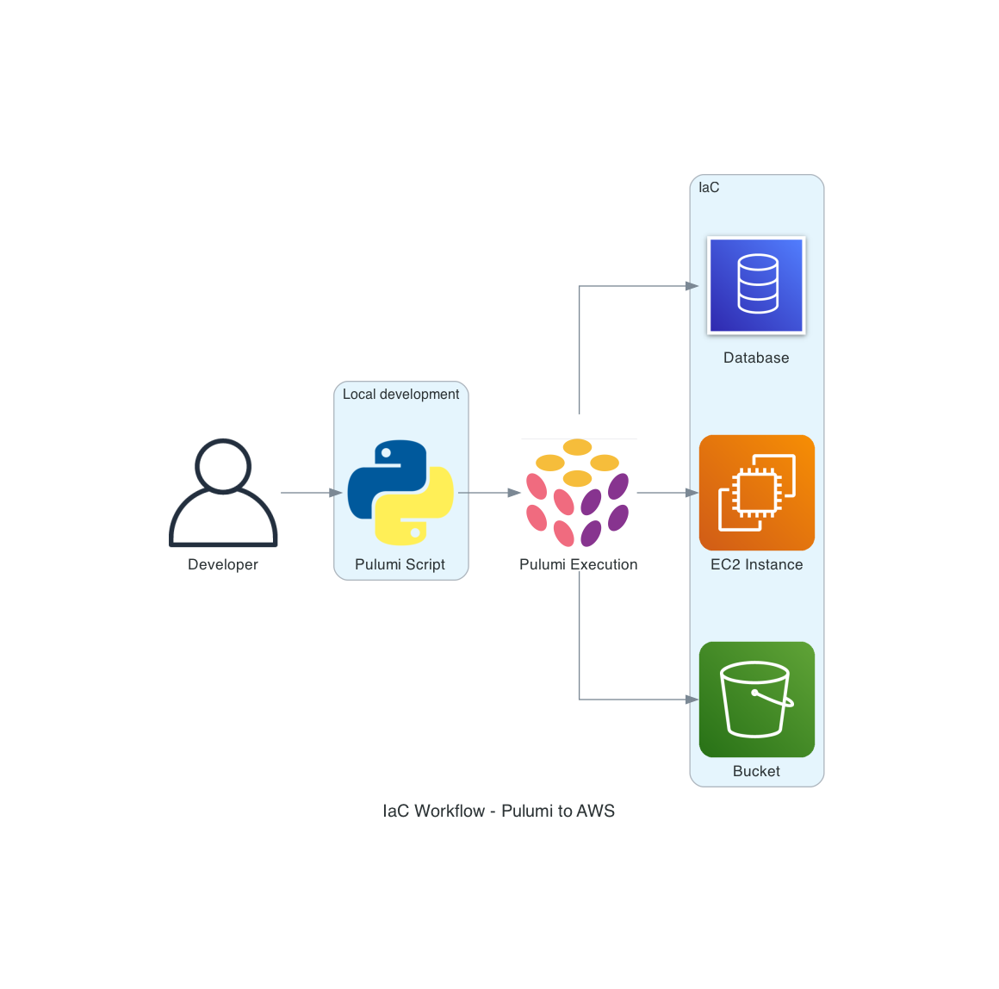
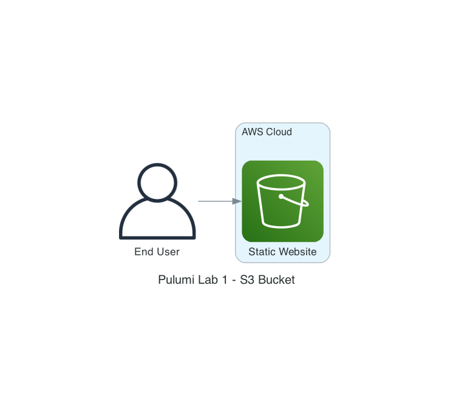
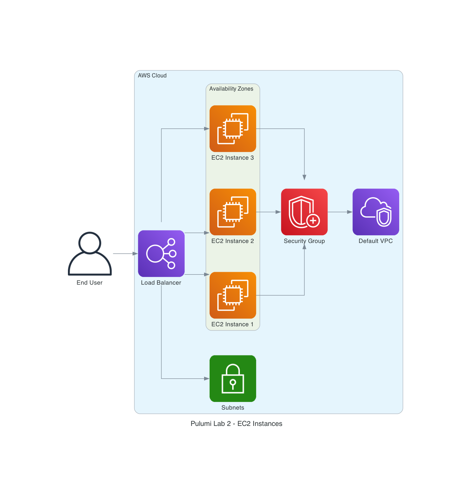
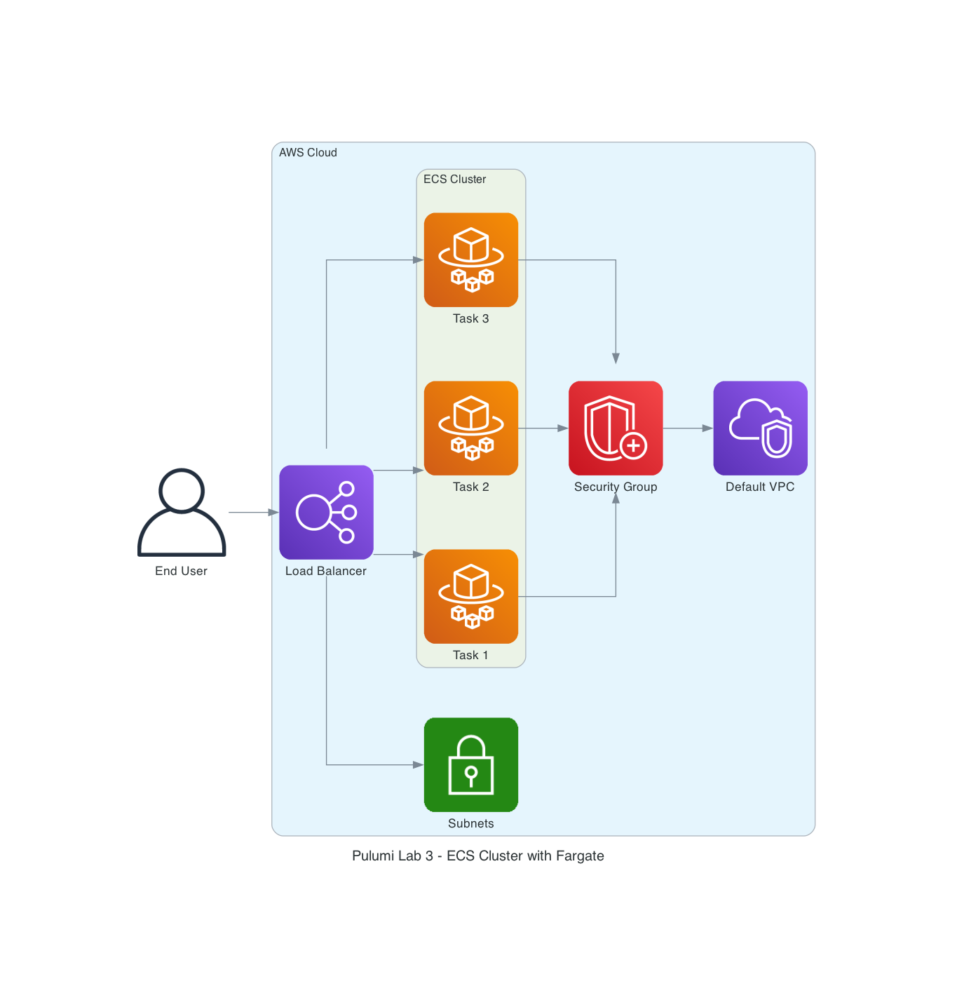

# Infrastructure as Code - AWS Lab

## Getting started

This repository contains the code needed to create an AWS infrastructure using the Infrastructure as Code (IaC) approach with Pulumi.

### Lab 1 - S3 Bucket

The goal of this lab is to create an Amazon S3 bucket and load static files into it to create a simple website.

<a href="/iac-lab1/#README.md">See more</a>

### Lab 2 - EC2 Instances

The goal of this lab is to create Amazon EC2 instances, a security group and a load balancer for a basic web server environment.

<a href="/iac-lab2/#README.md">See more</a>

### Lab 3 - ECS Cluster with Fargate

The objective of this lab is to create an Amazon ECS cluster using the Fargate service, along with an Application Load Balancer (ALB) load balancer, to deploy a containerized application.

<a href="/iac-lab3/#README.md">See more</a>

